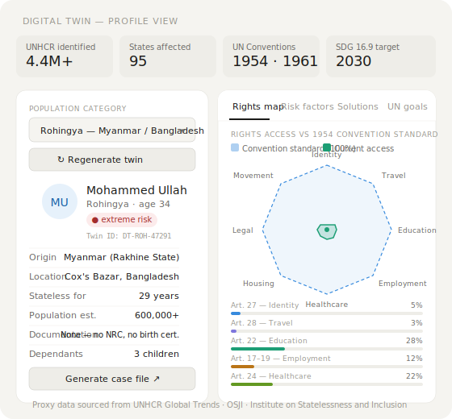
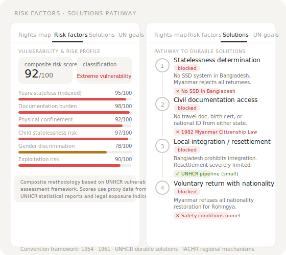
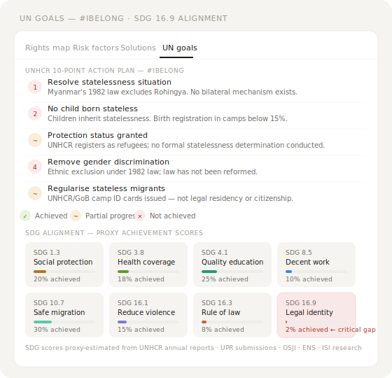
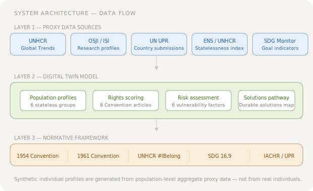

# Stateless Persons Digital Twin
### UN 1954 Convention Framework · UNHCR #IBelong · SDG 16.9

**[→ Open the Live Prototype](https://lequanne.github.io/digital-twin-UN-stateless/)**

A prototype digital twin system that models the legal situation, rights access, vulnerability profile, and pathway to durable solutions for stateless persons across six documented populations — grounded in the UN 1954 Convention on the Status of Stateless Persons, the UNHCR #IBelong 10-Point Action Plan, and SDG 16.9 (legal identity for all by 2030).

---

## What Is a Digital Twin?

A **digital twin** is a dynamic virtual model of a real-world system, object, or population that mirrors its current state and simulates how it evolves under different conditions. In humanitarian and policy contexts, digital twins allow analysts, advocates, and decision-makers to:

- Visualise the current state of a system or population without waiting for costly data collection
- Test the impact of interventions before committing resources
- Identify structural bottlenecks that prevent change
- Communicate complex, multi-variable situations clearly to non-specialist audiences

Traditional humanitarian data pipelines are slow, patchy, and often exclude the most marginalised populations — precisely because stateless persons lack the documentation that most data systems require. A proxy-based digital twin addresses this gap by constructing representative profiles from population-level aggregate evidence, letting us study a population that is otherwise nearly invisible.

### Why Statelessness?

Stateless persons sit in a unique gap in international law. They are not citizens of any state, which means the normal mechanisms of protection — consular assistance, national social services, legal identity documents, voting rights — do not apply. The UN estimates **at least 4.4 million people** are stateless, though the true figure is likely far higher due to underreporting.

> *"A person who is not considered as a national by any State under the operation of its law."*
> — Article 1, 1954 Convention on the Status of Stateless Persons

Statelessness is frequently inherited across generations, and is often rooted in colonial-era exclusions, post-independence citizenship laws designed to exclude ethnic minorities, or state succession that leaves populations between jurisdictions. The consequences are severe: no birth certificate, no school enrolment, no employment contract, no ability to open a bank account, no access to healthcare systems, and no recourse when rights are violated.

---

## Covered Populations

The prototype models six documented stateless populations using UNHCR proxy data:

| Population | Region | Est. Stateless | Primary Cause |
|---|---|---|---|
| **Rohingya** | Myanmar / Bangladesh | 600,000+ | Ethnic exclusion under 1982 Citizenship Law |
| **Bidun** | Gulf states (Kuwait, UAE) | ~100,000 | Exclusion at Kuwait's 1961 independence |
| **Roma** | Eastern Europe (Balkans, EU) | ~600,000 at risk | Post-Yugoslav administrative statelessness |
| **Nubian-Kenyan** | Kenya (Kibera, Northern Kenya) | ~100,000 | Colonial-era exclusion; discriminatory vetting |
| **Haitian-Dominican** | Dominican Republic | ~133,000 denaturalised | TC 168-13 retroactive denaturalisation ruling |
| **Post-Soviet** | Baltic states / CIS | ~580,000 | State succession after USSR dissolution |

---

## Prototype Components

### 1 — Twin Profile Card

The profile generator creates a synthetic individual profile drawn from the population's known demographic range, statelessness duration, documentation status, and household composition. Each twin is assigned a unique ID and risk classification.



**What it shows:**
- Synthetic individual (name, age, dependants) representative of the population category
- Region, origin, statelessness duration, documentation status
- Risk level badge: *extreme / high / moderate / low*
- "Generate case file" prompt — sends the twin's context to Claude for a full legal intervention analysis

---

### 2 — Rights Map (1954 Convention)

A radar chart maps the population's actual access to rights against the standard set by the 1954 Convention. Eight rights domains are tracked, each keyed to specific Convention articles.



| Domain | Convention Article | Description |
|---|---|---|
| Identity documents | Art. 27 | Right to identity papers where no travel document is available |
| Travel documents | Art. 28 | Right to a Convention Travel Document |
| Education | Art. 22 | Access to public education on the same terms as nationals |
| Employment | Art. 17–19 | Right to work in wage employment, self-employment, and liberal professions |
| Healthcare | Art. 24 | Labour legislation and social security |
| Housing | Art. 21 | Access to housing on the most favourable terms |
| Legal access | Art. 16 | Free access to courts of law |
| Movement | Art. 26 | Freedom of movement and choice of residence |

---

### 3 — Risk Factor Profile

A composite vulnerability score built from six factors drawn from UNHCR's vulnerability assessment framework:

- **Years stateless (indexed)** — duration as a proxy for generational entrenchment
- **Documentation burden** — severity of lack of civil documentation
- **Physical confinement** — camp confinement, movement restrictions
- **Child statelessness risk** — likelihood children inherit the status
- **Gender discrimination** — gendered nationality law or practice
- **Exploitation risk** — vulnerability to trafficking, forced labour, and abuse

---

### 4 — Solutions Pathway

Modelled on UNHCR's three durable solutions (voluntary return, local integration, third-country resettlement) plus a fourth requirement specific to statelessness: **nationality acquisition**. Each step is assessed as achieved, partial, or blocked, with documented barriers and enablers.

---

### 5 — UN Goals Panel



Two frameworks are tracked:

**UNHCR #IBelong — 10-Point Action Plan (2014–2024)**

| # | Action | Status key |
|---|---|---|
| 1 | Resolve statelessness situations | ✓ Achieved / ~ Partial / ✕ Not achieved |
| 2 | Ensure no child is born stateless | |
| 3 | Remove gender discrimination from nationality laws | |
| 4 | Prevent statelessness through state succession | |
| 5 | Grant protection status to stateless migrants | |
| 6 | Facilitate birth registration | |
| 7 | Issue nationality documentation | |
| 8 | Accede to UN statelessness conventions | |
| 9 | Improve statelessness data | |
| 10 | Strengthen solutions for stateless persons | |

**Sustainable Development Goals (proxy achievement scores)**

| Goal | Indicator | Relevance |
|---|---|---|
| SDG 1.3 | Social protection | Stateless persons excluded from national safety nets |
| SDG 3.8 | Universal health coverage | No legal identity = no health system access |
| SDG 4.1 | Quality education | Without documents, children cannot enrol |
| SDG 8.5 | Decent work | No work permit possible without nationality or legal status |
| SDG 10.7 | Safe migration | Stateless persons cannot legally migrate |
| SDG 16.1 | Reduce violence | Statelessness correlates with exposure to violence |
| SDG 16.3 | Rule of law | No access to justice without legal standing |
| **SDG 16.9** | **Legal identity for all** | **The primary SDG target — by 2030** |

---

## System Architecture



The twin is structured in three layers:

**Layer 1 — Proxy data sources**
Population-level aggregate data from UNHCR Global Trends, Open Society Justice Initiative (OSJI), Institute on Statelessness and Inclusion (ISI), European Network on Statelessness (ENS), country UPR submissions, and SDG monitoring indicators.

**Layer 2 — Twin model**
Six population profiles × eight rights dimensions × six risk factors × four-step solutions pathway + 10-point UNHCR action plan assessment + eight SDG indicators.

**Layer 3 — Normative framework**
All scores and assessments are anchored to the 1954 Convention, the 1961 Convention on the Reduction of Statelessness, the UNHCR #IBelong campaign, SDG 16.9, and regional mechanisms including the IACHR and UPR process.

---

## On Proxy Data

Because stateless persons by definition lack documentation, they are severely underrepresented in standard data systems. This prototype uses **proxy migration data** — population-level aggregate statistics from humanitarian organisations — to construct representative individual profiles.

Proxy data sources used include:

- **UNHCR Global Trends in Forced Displacement** (annual)
- **UNHCR Statistical Yearbook** — statelessness annexes
- **Institute on Statelessness and Inclusion** — country-level statelessness profiles
- **Open Society Justice Initiative** — legal case documentation (Nubian, Haitian-Dominican, Roma)
- **European Network on Statelessness** — European statelessness index
- **OBMICA** — Dominican Republic statelessness research
- **UNICEF / WHO** — birth registration and health access data by country
- **UN Universal Periodic Review** country submissions

> **Important limitation:** Proxy data reflects the best available population-level evidence. Individual synthetic profiles are generated from demographic ranges — they do not represent or identify any real person. Rights and SDG scores are estimates calibrated to documented conditions, not precision measurements.

---

## Normative Basis

| Instrument | Year | Status | Purpose |
|---|---|---|---|
| Convention Relating to the Status of Stateless Persons | 1954 | 98 states parties | Defines statelessness; establishes minimum rights |
| Convention on the Reduction of Statelessness | 1961 | 78 states parties | Prevents new statelessness at birth and through state succession |
| UNHCR #IBelong Campaign | 2014–2024 | Concluded | 10-point action plan; global commitment to end statelessness |
| SDG 16.9 | 2015–2030 | Active | Legal identity for all by 2030, including birth registration |
| IACHR regional framework | Ongoing | Regional | Inter-American human rights; relevant to Dominican Republic case |

---

## How to Use

1. Open the [live prototype](https://lequanne.github.io/statelessness-digital-process-twin/)
2. Select a population from the dropdown (Rohingya, Bidun, Roma, Nubian-Kenyan, Haitian-Dominican, Post-Soviet)
3. Click **Regenerate twin** to generate a new synthetic profile drawn from that population's documented range
4. Navigate between tabs — **Rights map**, **Risk factors**, **Solutions**, **UN goals**
5. Use the **Generate case file** and **Analyse SDG 16.9 gap** prompts to trigger AI-assisted legal analysis

---

## Use Cases

- **Policy advocacy** — visualise and communicate the rights gap for a specific population to non-specialist audiences
- **Legal research** — map Convention article compliance against documented country conditions
- **Humanitarian planning** — assess which durable solutions are structurally blocked and why
- **Education** — use the prototype to teach statelessness, international refugee law, and the SDG framework
- **Data gap identification** — the populations with the lowest SDG 16.9 scores are those most in need of dedicated data collection

---

## Project Structure

```
/
├── stateless-digital-twin.html   # Self-contained prototype (HTML + CSS + JS)
├── screenshots/
│   ├── 01-twin-profile.svg       # Twin profile card component
│   ├── 02-risk-pathway.svg       # Risk factors and solutions pathway
│   ├── 03-un-goals.svg           # UNHCR action plan and SDG alignment
│   └── 04-architecture.svg       # System architecture diagram
└── README.md
```

---

## References

```markdown
## References

**UN Legal Instruments**

1. UN General Assembly (1954). *Convention Relating to the Status of Stateless Persons.* New York: UN.
   → [Full text — OHCHR](https://www.ohchr.org/en/instruments-mechanisms/instruments/convention-relating-status-stateless-persons) · [Treaty collection — UN](https://treaties.un.org/Pages/ViewDetails.aspx?src=TREATY&mtdsg_no=V-3&chapter=5&clang=_en)

2. UN General Assembly (1961). *Convention on the Reduction of Statelessness.* New York: UN.
   → [Full text — OHCHR](https://www.ohchr.org/en/instruments-mechanisms/instruments/convention-reduction-statelessness) · [Treaty collection — UN](https://treaties.un.org/Pages/ViewDetails.aspx?src=TREATY&mtdsg_no=V-4&chapter=5&clang=_en)

3. UN General Assembly (2015). *Transforming Our World: The 2030 Agenda for Sustainable Development* (SDG 16.9). New York: UN.
   → [SDG 16 full text](https://sdgs.un.org/goals/goal16) · [2030 Agenda resolution A/RES/70/1](https://sdgs.un.org/2030agenda)

---

**UNHCR Reports & Campaigns**

4. UNHCR (2023). *Global Trends: Forced Displacement in 2022.* Geneva: UNHCR.
   → [Report landing page](https://www.unhcr.org/global-trends-report-2022) · [Data portal](https://data.unhcr.org/en/documents/details/101302)

5. UNHCR (2014). *Global Action Plan to End Statelessness: 2014–2024.* Geneva: UNHCR.
   → [#IBelong campaign page](https://www.unhcr.org/ibelong/global-action-plan-2014-2024/) · [PDF via UNHCR Emergency Handbook](https://emergency.unhcr.org/sites/default/files/2023-12/Global%20Action%20Plan%20to%20end%20Statelessness,%202014-2024.pdf)

6. UNHCR (2024). *Global Action Plan to End Statelessness 2.0.* Geneva: UNHCR.
   → [Refworld](https://www.refworld.org/policy/strategy/unhcr/2024/en/148761)

7. UNHCR. *UN Conventions on Statelessness — overview.*
   → [UNHCR US explainer](https://www.unhcr.org/us/what-we-do/protect-human-rights/ending-statelessness/un-conventions-statelessness)

---

**Research Organisations & Indices**

8. Institute on Statelessness and Inclusion (2020). *The World's Stateless: Deprivation of Nationality.* Tilburg: ISI.
   → [Refworld record](https://www.refworld.org/reference/themreport/isi/2020/en/123325) · [ISI flagship reports](https://www.institutesi.org/our-work/research)

9. European Network on Statelessness (2023). *Statelessness Index.* London: ENS.
   → [Live index](https://index.statelessness.eu/) · [Methodology](https://index.statelessness.eu/about/methodology) · [2023 update editorial](https://www.statelessness.eu/updates/editorial/statelessnessindex-shows-opportunities-protect-stateless-people-europe-we-must)

10. European Network on Statelessness. *ENS main site — resources, publications, litigation bulletin.*
    → [statelessness.eu](https://www.statelessness.eu/)

---

**Population-Specific Sources** 

11. Open Society Justice Initiative (2010). *Nationality and Discrimination: The Case of Kenyan Nubians.* New York: OSJI.
    → [OSJI publication page](https://www.justiceinitiative.org/publications/nationality-and-discrimination-case-kenyan-nubians)

12. Open Society Justice Initiative. *The Nubian Predicament: Colonial Legacy, Discrimination, and Statelessness.*
    → [OSJI article](https://www.justiceinitiative.org/voices/nubian-predicament-story-about-colonial-legacy-discrimination-and-statelessness)

13. Amnesty International (2015). *Statelessness in the Dominican Republic.*
    → [AMR 27/2755/2015](https://www.amnesty.org/en/documents/amr27/2755/2015/en/)

14. Human Rights Watch (2022). *World Report — Kenya chapter* (includes Nubian statelessness).
    → [HRW Kenya 2022](https://www.hrw.org/world-report/2022/country-chapters/kenya)

15. US Department of State (2022). *Country Reports on Human Rights Practices: Kenya.*
    → [State Dept. Kenya report](https://www.state.gov/reports/2022-country-reports-on-human-rights-practices/kenya)

---

**Academic**

16. Blitz, B.K. & Lynch, M. (Eds.) (2011). *Statelessness and Citizenship: A Comparative Study on the Benefits of Nationality.* Cheltenham: Edward Elgar.
    → [Publisher page — Elgar Online](https://www.elgaronline.com/view/edcoll/9781849800679/9781849800679.xml) · [WorldCat record](https://lawcat.berkeley.edu/record/191161)

---

## License

MIT — open for adaptation, research, and advocacy use. If you build on this prototype, please cite the underlying UNHCR and ISI data sources and note the proxy data limitation.
